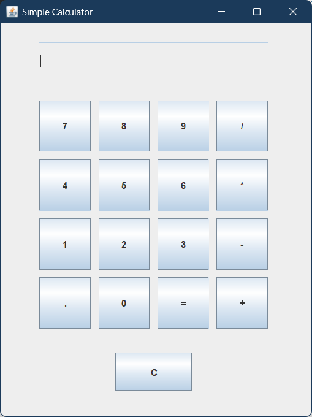

# Simple-Calculator---Java
This Java project is a simple calculator with a graphical user interface (GUI) using Swing. It includes buttons for numbers, basic operations (addition, subtraction, multiplication, division), a decimal point, and a clear function. The calculator processes user inputs and displays results, demonstrating basic event handling and GUI layout in Java.


## Technology Stack
- Programming Language: Java
- Graphical User Interface (GUI) Toolkit: Swing

## How to Run

1. Clone the repository to your local machine.
2. Open a terminal window and navigate to the project directory.
3. Run the Calculator Application using the following command:

```bash
  java calculator
```
## Screenshot



